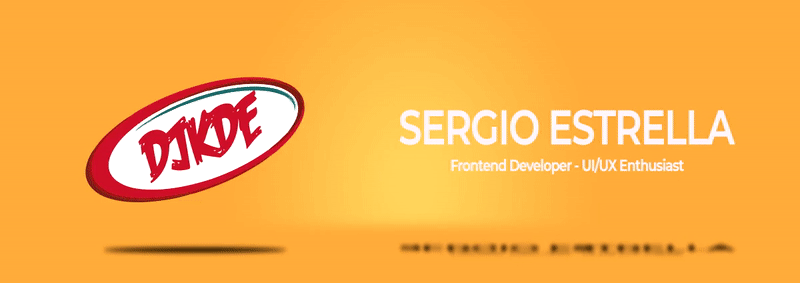

### Hi there 👋

Good to see you! My name is Sergio Estrella, also known into the internet as Djkde 😄

I'm a Frontend Developer trained in HTML CSS, JS and React. Passionate about sharing everything I am learning. With the ability and desire to work in a collaborative environment. Interested in UI design and audiovisual production. 

Also, I'm a student at Platzi, belonging to the [Platzi Master Program](https://platzi.com/blog/que-es-platzi-master/), a program for the top 0.1% of students. In there, I've been intensely trained about Frontend Development.

### 🚀 My Stack
- Vanilla JavaScript
- React.js
- CSS (Pure and using SASS or Tailwind)
- Figma
- Next.js

### 📚 I am currently learning
- Advanced React.js 
- Jest
- UI Design
- Algorithms
- SQL
- GraphQL

### 📬 You can contact me on
- [Twitter](https://twitter.com/djkde)
- [LinkedIn](https://linkedin.com/in/djkde)
- [Mail me](mailto:me@djkde.com)
- [My portfolio](https://djkde.com)

<!--
**Djkde01/Djkde01** is a ✨ _special_ ✨ repository because its `README.md` (this file) appears on your GitHub profile.

Here are some ideas to get you started:

- 🔭 I’m currently working on ...
- 🌱 I’m currently learning ...
- 👯 I’m looking to collaborate on ...
- 🤔 I’m looking for help with ...
- 💬 Ask me about ...
- 📫 How to reach me: ...
- 😄 Pronouns: ...
- ⚡ Fun fact: ...
-->
